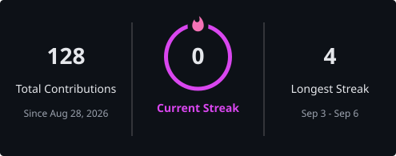

<!-- ================= HEADER ================= -->

  

 

<!-- ================= ABOUT ME ================= -->

## 👋 About Me

 

I'm Tashvi Adhlakha, a second-year B.Tech CSE student specializing in **AI & ML**, with a strong interest in AI, software development, and creative problem-solving.

I enjoy building projects, participating in hackathons, exploring emerging technologies, and turning ideas into practical solutions.

I also enjoy **presentation design and visual communication**, creating clear and engaging presentations that communicate ideas effectively.

**2nd-year B.Tech CSE (AI & ML) student @ Jain University**

 

<!-- ================= TECH STACK ================= -->

## 🛠️ Tech Stack

  

**AI/ML:** Python · Java · C · Git · GitHub · VS Code · Next.js · NestJS · Gemini · Claude · Perplexity · Generative AI · RAG · Prompt Engineering · Google Colab · Canva · Antigravity IDE · Cursor

 

<!-- ================= PROJECTS ================= -->

## 🛠️ Things I Built

<table width="100%">
<tr>
<th width="25%" align="left">Project</th>
<th width="50%" align="left">Description</th>
<th width="25%" align="left">Tech / Focus</th>
</tr>

<tr>
<td><strong>🧭 Dishaara</strong></td>
<td>AI-powered tourism platform focused on safer, smarter and more personalized travel across India</td>
<td>AI · Tourism · Safety · Maps · Hackathon</td>
</tr>

<tr>
<td><strong>📚 Nexora</strong></td>
<td>AI-powered adaptive learning platform designed to personalize learning for students</td>
<td>AI · LLMs · Education · RAG</td>
</tr>

<tr>
<td><strong>🤖 ChangeRehearsal</strong></td>
<td>AI-assisted development project built to explore smarter software development workflows</td>
<td>AI · IBM Bob · Hackathon</td>
</tr>

<tr>
<td><strong>✨ Personal Gemini Journal</strong></td>
<td>AI-powered personal journaling experience built as part of the APAC GDG Challenge</td>
<td>Gemini · AI · GDG Challenge</td>
</tr>

<tr>
<td><strong>📅 Academic Timetable</strong></td>
<td>Academic timetable project designed to organize schedules in a simple interface</td>
<td>Java · UI Development</td>
</tr>

</table>

 

<!-- ================= HACKATHONS ================= -->

## 🏆 Hackathons & Experiences

<table width="100%">
<tr>
<th width="30%" align="left">Hackathon / Experience</th>
<th width="45%" align="left">What I Did</th>
<th width="25%" align="left">Focus</th>
</tr>

<tr>
<td><strong>🇮🇳 Smart India Hackathon</strong></td>
<td>Worked on an AI-driven tourism solution addressing travel discovery, safety and accessibility</td>
<td>AI · Tourism · Innovation</td>
</tr>

<tr>
<td><strong>⚡ IBM Bob 2.0 Hackathon</strong></td>
<td>Participated in a second IBM Bob innovation challenge and explored AI-powered development workflows</td>
<td>AI · Innovation</td>
</tr>

<tr>
<td><strong>💡 Vivekananda Innovation Hackathon 2026</strong></td>
<td>Participated in an innovation-focused hackathon and worked on technology-driven problem solving</td>
<td>Innovation · Technology</td>
</tr>

<tr>
<td><strong>🌐 Build with APAC GDG Challenge</strong></td>
<td>Built Personal Gemini Journal as part of the APAC GDG Challenge</td>
<td>Gemini · Generative AI</td>
</tr>

</table>

 

<!-- ================= CURRENTLY LEARNING ================= -->

## 📚 Currently Learning

<table width="80%" align="center" border="0" frame="void" rules="none" cellspacing="0" cellpadding="0">
<tr>

<td width="3%" border="0"></td>

<td width="45%" valign="top" border="0">

<table width="100%">
<tr>
<td>

<strong>AI & Machine Learning</strong>

<table width="100%">
<tr><td>AI Fundamentals</td></tr>
<tr><td>Machine Learning Concepts</td></tr>
<tr><td>Generative AI & LLMs</td></tr>
<tr><td>RAG Models</td></tr>
</table>

</td>
</tr>
</table>

</td>

<td width="10%" border="0"></td>

<td width="45%" valign="top" border="0">

<table width="100%">
<tr>
<td>

<strong>Development & AI Tools</strong>

<table width="100%">
<tr><td>Full-Stack Development</td></tr>
<tr><td>Python / Java / C Fundamentals</td></tr>
<tr><td>Agentic AI</td></tr>
<tr><td>AI-Assisted Development</td></tr>
</table>

</td>
</tr>
</table>

</td>

<td width="3%" border="0"></td>

</tr>
</table>

 

<!-- ================= GITHUB STATS ================= -->

## 📊 GitHub Stats

<table width="100%">
<tr>

<td width="33%" align="center">

</td>

<td width="33%" align="center">

</td>

<td width="34%" align="center">

</td>

</tr>
</table>

 

<!-- ================= CONTRIBUTION SNAKE ================= -->

## 🐍 Contribution Journey

<picture>
  <source
    media="(prefers-color-scheme: dark)"
    srcset="https://raw.githubusercontent.com/TashStack-18/TashStack-18/output/github-snake-dark.svg"
  />

  <source
    media="(prefers-color-scheme: light)"
    srcset="https://raw.githubusercontent.com/TashStack-18/TashStack-18/output/github-snake.svg"
  />

  

</picture>

 

---

<!-- ================= CONNECT ================= -->
## 🤝 Let's Connect

  
  &nbsp;&nbsp;
  

 

---

**Still learning. Still building. Still curious. ✨**

Let's build something interesting.

