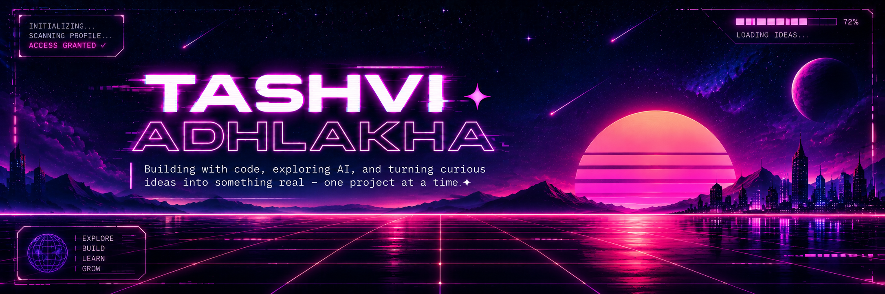
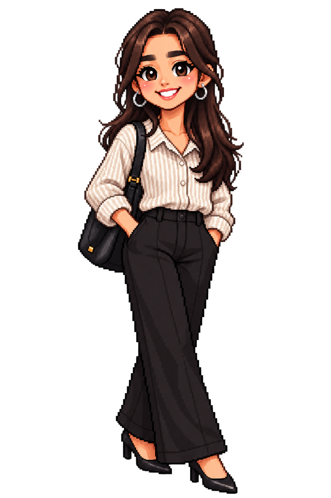

<!-- ========================================================= -->
<!--                         HEADER                            -->
<!-- ========================================================= -->

  

 

<!-- ========================================================= -->
<!--                       ABOUT ME                            -->
<!-- ========================================================= -->

<table width="100%">
<tr>

<td width="65%" valign="middle">

# Hey, I'm Tashvi 👋

### CSE (AI & ML) Student • Developer • Creative Builder

I'm a second-year **Computer Science & Engineering (AI & ML)** student who enjoys turning ideas into practical digital experiences.

I love exploring **AI, development, design, and creative problem-solving** — from building AI-powered platforms to creating clean presentations and user-focused interfaces.

Currently learning, experimenting, building, and trying to make every project a little better than the last.

</td>

<td width="35%" align="center">

</td>

</tr>
</table>

---

<!-- ========================================================= -->
<!--                       TECH STACK                          -->
<!-- ========================================================= -->

## 🛠️ Tech Stack

<table width="100%">
<tr>
<th>Category</th>
<th>Technologies</th>
</tr>

<tr>
<td><b>Programming</b></td>
<td>

</td>
</tr>

<tr>
<td><b>AI & AI Tools</b></td>
<td>

</td>
</tr>

<tr>
<td><b>Development</b></td>
<td>

</td>
</tr>

<tr>
<td><b>Tools</b></td>
<td>

</td>
</tr>

</table>

<!-- ========================================================= -->
<!--                        PROJECTS                            -->
<!-- ========================================================= -->

## 🚀 Things I've Built

<table width="100%" cellspacing="0" cellpadding="12">

<tr>
<th width="25%" align="left">Project</th>
<th align="left">Description</th>
</tr>

<tr>
<td><b>🧭 Dishaara</b></td>
<td>
<b>AI-powered tourism platform</b> designed to make travel safer, smarter, and more personalized.
  
<code>AI</code> <code>Tourism</code> <code>Safety</code> <code>Hackathon</code>
</td>
</tr>

<tr>
<td><b>📚 Nexora</b></td>
<td>
<b>AI-powered learning platform</b> focused on adaptive and personalized learning experiences.
  
<code>AI</code> <code>Education</code> <code>LLMs</code>
</td>
</tr>

<tr>
<td><b>🤖 ChangeRehearsal</b></td>
<td>
An <b>IBM Bob Hackathon</b> project exploring AI-assisted development and creative problem solving.
  
<code>AI</code> <code>IBM Bob</code> <code>Hackathon</code>
</td>
</tr>

<tr>
<td><b>✨ Personal Gemini Journal</b></td>
<td>
A personal AI journaling project created for the <b>Build with APAC GDG Challenge</b>.
  
<code>Gemini</code> <code>AI</code> <code>GDG</code>
</td>
</tr>

</table>

---

<!-- ========================================================= -->
<!--                  HACKATHONS & EXPERIENCES                  -->
<!-- ========================================================= -->

## 🏆 Hackathons & Experiences

<table width="100%" cellspacing="0" cellpadding="10">

<tr>
<td width="8%" align="center">🏆</td>
<td><b>Smart India Hackathon</b></td>
</tr>

<tr>
<td align="center">🤖</td>
<td><b>IBM Bob 2.0 Hackathon</b></td>
</tr>

<tr>
<td align="center">💡</td>
<td><b>Vivekananda Innovation Hackathon 2026</b></td>
</tr>

<tr>
<td align="center">✨</td>
<td><b>Build with APAC GDG Challenge</b></td>
</tr>

</table>

---

<!-- ========================================================= -->
<!--                    CURRENTLY LEARNING                      -->
<!-- ========================================================= -->

## 📚 Currently Learning

<table width="100%">
<tr>

<td width="50%" valign="top">

###🤖 AI & Machine Learning

| Learning |
|---|
| AI Fundamentals |
| Machine Learning Concepts |
| Generative AI & LLMs |
| RAG Models |

</td>

<td width="50%" valign="top">

###💻 Development & AI Tools

| Learning |
|---|
| Full-Stack Development |
| Python / Java / C Fundamentals |
| Agentic AI |
| AI-Assisted Development |

</td>

</tr>
</table>

---

<!-- ========================================================= -->
<!--                    GITHUB ANALYTICS                        -->
<!-- ========================================================= -->

## 📊 GitHub Stats

<table width="100%">
<tr>

<td width="33%" align="center">

</td>

<td width="33%" align="center">

</td>

<td width="34%" align="center">

</td>

</tr>
</table>

---

<!-- ========================================================= -->
<!--                  CONTRIBUTION SNAKE                        -->
<!-- ========================================================= -->

## 🐍 Contribution Journey

<picture>

<source
  media="(prefers-color-scheme: dark)"
  srcset="https://raw.githubusercontent.com/TashStack-18/TashStack-18/output/github-snake-dark.svg"
/>

<source
  media="(prefers-color-scheme: light)"
  srcset="https://raw.githubusercontent.com/TashStack-18/TashStack-18/output/github-snake.svg"
/>

</picture>

---

<!-- ========================================================= -->
<!--                       CONNECT                              -->
<!-- ========================================================= -->

## 🌐 Let's Connect

---

<!-- ========================================================= -->
<!--                         FOOTER                             -->
<!-- ========================================================= -->

### Still learning. Still building. Still curious. ✨

**Let's build something interesting.**

